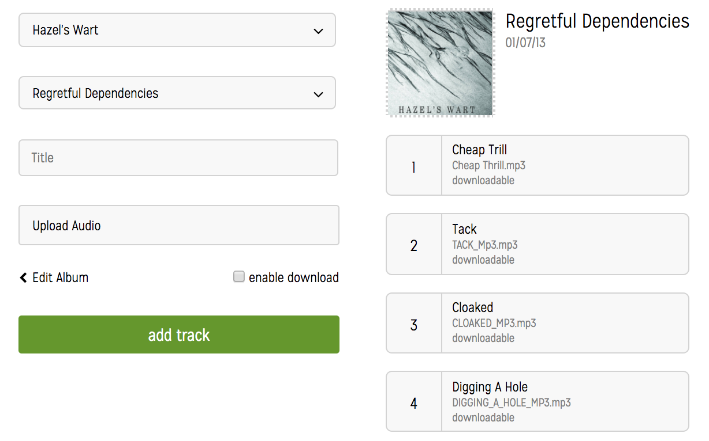
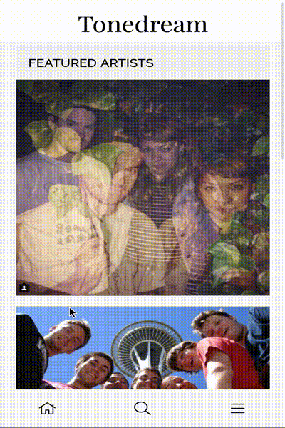

[Live Demo][tonedream]

[tonedream]: https://tonedream.herokuapp.com/

Tonedream is an independent music network built using Ruby on Rails
and React/Redux. 

# Tonedream Features

## Audio Player

The audio player uses the React Howler Audio Player, which is a wrapper for the Web Audio API. I chose this player because it does not provide a UI which allowed me to style and design my own. The player can shuffle and loop a single track or album.

## Album Pages

All user's on tonedream can be the admin of multiple artists. They can upload their music and allow others to download it. They also have the option of making it only available for streaming. Above is a screenshot of an album page.

## Upload Tracks

You can easily add albums to any artist. Just go to settings > albums. Then select which artist you want and either edit or add a new album and start uploading your tracks!

## Search

A search feature allows for quick search of the database for music. The results are split up into tracks, albums, and artists.

# What's happening on the development branch

The search component from the development branch has been refactored to display the results separated out in three separate sections -- Artist, Albums, or Tracks. I do this by pushing an article element into the array when the type changes.

![search](docs/search.png=

A complete responsive redesign, with the mobile version being a simple music streaming app and the full browser version capable of all other current features plus the following planned features.

# Planned Features

## Audio Player

Add sound bar and volume adjustment. Implement "add to up next feature" which will add a song to a queue to be played next.

## Purchases

Implementation of Stripe or Square API to allow users to sell music. 

## Follows and a "wall"

Allow User's to follow Artists and Record Labels. Create a Facebook like wall where artists can share events and news that will be shown to their followers.

## Events

Facebook style events.
