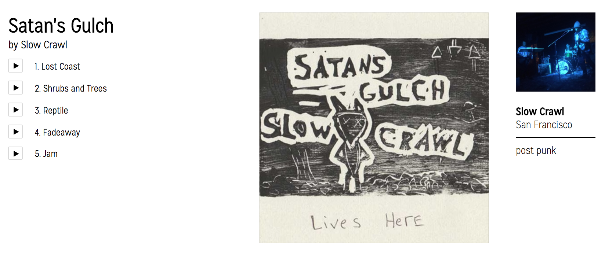
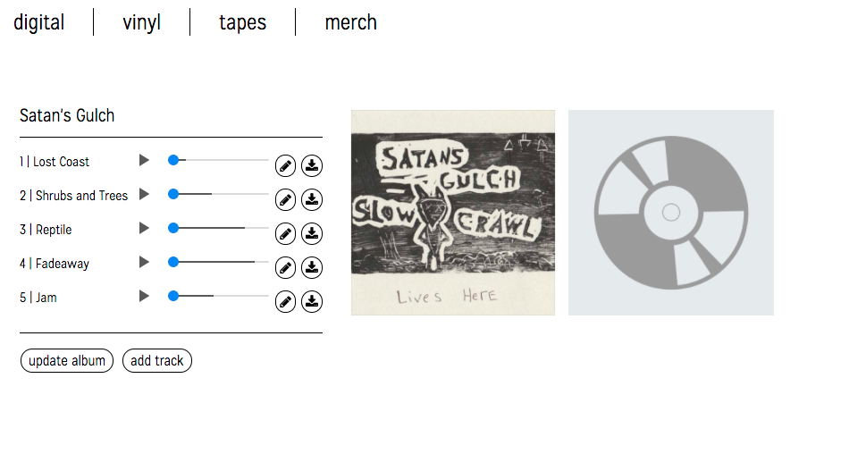
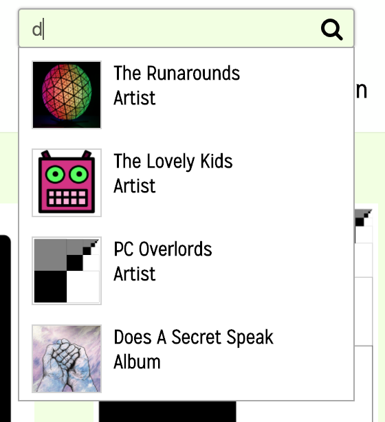

[Live Demo][tonedream]

[tonedream]: https://tonedream.herokuapp.com/

Tonedream is an independent music network built using Ruby on Rails
and React/Redux.  The goal of tonedream is to connect indenpendent DIY muscians and give them a 
platform to sell there music at no cost. 

# Tonedream Features

## Artist Pages

All user's on tonedream are musicians. Musicians can download and upload there music and make it available for download. Tonedream utilizes minimalist design patterns
to allow a clutter free experience for both the fan and musician. This allows for easy navigation and a focus on the music. 

User's can upload and edit their profile -- which includes an artist/band name, bio, location, and profile picture. The album art can also be added/changed when necessary. 

The song player utilizes the HTML5 audio player. To view the tracks from an album, simply click on an album.

## Song Player

A musician can easily create, upload, download, and destroy tracks and albums. Tracks can also be edited. The editable contents of a track include: title, track number, the track itself, and whether they want it to be downloadable.

## Search

To find other music and musicians, search is enabled on the main page. The results are split up into tracks, albums, and artist/bands. This allows for easy location of other musicians in the network. This search was implemented with the help of: [mincer_ray][mincer_ray]

[mincer_ray]: https://github.com/mincer-ray/grandcamp/blob/master/app/controllers/api/searches_controller.rb

# The Future

The future is bright at tonedream. Planned features:

## Fan and Record Label account

Fan accounts will allow musicians to more easily connect to their fans.
Indepentent Record Label accounts will provide a central network for labels to promote and sell music.

## Follows

Allow Labels, Artists, and Bands to follow eachother

## Events

Provide a space for fans to go to know where their favorite bands are playing.
