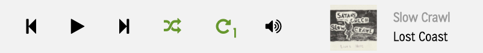

[Live Demo][tonedream]

[tonedream]: https://tonedream.herokuapp.com/

Tonedream is an independent music network built using Ruby on Rails
and React/Redux.  The goal of tonedream is to connect indenpendent DIY muscians and give them a 
platform to sell there music at no cost. 

# Tonedream Features

## Album Pages

All user's on tonedream can be admin of multiple artists. They can upload there music and allow other to download it, or just make it available for streaming. Above is a screenshot of an album page.

## Audio Player

The song player uses the React Howler Audio Player, which is a wrapper for the Web Audio API. It allows for shuffle, looping a single track, and looping an album.

## Search

To find other music and musicians, search is enabled on the main page. The results are split up into tracks, albums, and artist. This allows for easy location of other musicians in the network. This search was implemented with the help of

# The Future

Planned features:

## Audio Player

Add sound bar and volume adjustment.

## Follows and a "wall"

Allow User's to follow Artists and Record Labels. Create a Facebook like wall where artists can share events and news that will be shown to their followers.

## Events

Provide a space for fans to go to know where their favorite bands are playing. Facebook style events.
